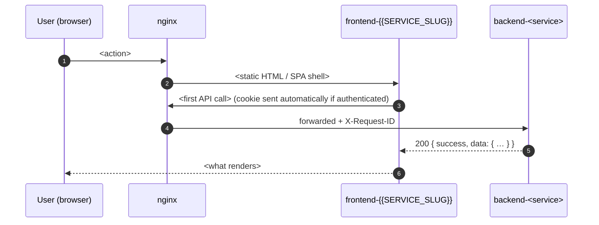

# frontend-{{SERVICE_SLUG}} — PRD & TDD (v{{N}})

> Per-repo product requirements and technical design for the **{{SERVICE_SLUG}}** frontend.
> Sibling frontend: [`../../../frontend-{{SIBLING_SLUG}}/docs/v{{N}}/PRD-TDD.md`](../../../frontend-{{SIBLING_SLUG}}/docs/v{{N}}/PRD-TDD.md).
> Platform architecture: [`tech/docs/project-architecture/v{{N}}.md`](../../../docs/project-architecture/v{{N}}.md).
> Cross-cutting standards: [`tech/docs/standards/`](../../../docs/standards/). Frontend-specific standards: [`tech/docs/standards/frontend.md`](../../../docs/standards/frontend.md) + [`tech/docs/standards/frontend-layout.md`](../../../docs/standards/frontend-layout.md). **Do not duplicate any of them here — link, quote, or note deviations only.**

---

> ## Repo-shape banner (read before writing a single section)
>
> A {{PROJECT_NAME}} frontend PRD-TDD covers **one** of two repo shapes. Pick one at the top and hold to it:
>
> | Shape | Stack | Hostname | Audience | Auth surface | SEO posture | This repo's typical sections |
> |---|---|---|---|---|---|---|
> | **`landing`** (SSG reader-facing site) | {{LANDING_STACK}} | `{{PUBLIC_DOMAIN}}` ({{LOCALE_MODE}}{{#IF LOCALE_MODE=farsi-only}}, native RTL{{/IF}}) | Anonymous visitor (public) | none — landing has no login; the dashboard lives on a different domain | **SEO-critical**, indexable; rebuild-on-publish | §11 says "no auth"; §13 covers {{#IF CALENDAR=jalali}}Jalali / Persian-digit boundary{{#ELSE}}locale / date-format boundary{{/IF}} depth; §16 is the deepest section; §17 carries the first-party pageview beacon only; §18 has no token-theft surface. |
> | **`dashboard`** (SPA editorial + admin panel) | {{DASHBOARD_STACK}} | `{{APP_DOMAIN}}` | {{DASHBOARD_ROLE_LIST_INLINE}} (post-login) | HTTP-only cookie + silent refresh | `noindex, nofollow` everywhere | §5 covers login + {{#IF BLOCK_EDITOR}}block-editor{{#ELSE}}form{{/IF}} flows; §11 is the deepest section; §16 is a one-paragraph "noindex" note. |
>
> **Standards are linked, never duplicated.** Anything already pinned in [`frontend.md`](../../../docs/standards/frontend.md) or [`frontend-layout.md`](../../../docs/standards/frontend-layout.md) is referenced by relative link — only deviations get repeated. [`frontend.md §2`](../../../docs/standards/frontend.md) is the binding stack contract — quote it, do not re-decide.

---

## 1. TL;DR

<One paragraph (≤ 6 lines). After reading, a PM / an engineer / an on-call should know: what this frontend is (repo shape + hostname + stack + build mode), the audience, the one invariant only this repo holds (e.g. "the only public SEO-indexable surface, rebuilt on every publish" for landing; "the only surface where an authenticated cookie reaches a browser" for dashboard), and the single biggest UX / correctness risk with the binding mitigation.>

---

## 2. Context & Problem

- **Where this fits.** <One sentence — static output behind the single platform nginx ingress{{#IF CDN_PROVIDER}} ({{CDN_PROVIDER}} CDN at the DNS layer){{/IF}} + link to architecture §. Name the backend surfaces this frontend consumes ({{#EACH CONSUMED_BACKENDS}}`{{this}}`{{#IF this.notlast}}, {{/IF}}{{/EACH}}).>
- **Problem it solves.** <Landing: serve the publication's rendered output with SEO-critical{{#IF LOCALE_MODE=farsi-only}} Persian-first{{/IF}} pages; dashboard: give editors a{{#IF LOCALE_MODE=farsi-only}} native-RTL{{/IF}}{{#IF BLOCK_EDITOR}} block editor,{{/IF}} editorial calendar, and moderation queue for the full publishing workflow.>
- **Why a separate repo from `frontend-{{SIBLING_SLUG}}`.** <Distinct build profile / audience / security posture / SEO posture / release cadence.>

---

## 3. Goals & Non-Goals

### 3.1 Goals (measurable)

Every goal has a metric and a v{{N}} target — a target of "report monthly, no numeric target for v{{N}}" is fine, but the metric is not optional.

| # | Goal | How we measure | Target (v{{N}}) |
|---|------|----------------|-------------|
| G1 | <shape-specific — e.g. Landing: every declared block type in the JSON block tree has a renderer / Dashboard: every declared block type has an editor + preview renderer> | {{#IF BLOCK_EDITOR}}block-fixture snapshot suite + contract-drift check{{#ELSE}}snapshot / contract-drift check{{/IF}} | 100% parity |
| G2 | Core Web Vitals on 4G/mobile Lighthouse | Lighthouse CI per MR | LCP ≤ 2.5 s, INP ≤ 200 ms, CLS ≤ 0.1; <scores ≥ 90 P/A/BP/SEO for landing / Performance ≥ 80 for dashboard shell> |
| G3 | Zero serious / critical axe-core violations on every Playwright scenario | axe assertion inside each e2e spec | **0** serious or critical, every run |
| G4 | Bundle stays under per-route budgets | `size-limit` in CI | per-route budgets in §15.2; CI fail on regression |
| G5 | No runtime request to a non-{{PROJECT_NAME}} origin beyond CSP-allow-listed exceptions{{#IF CAPTCHA_PROVIDER}} ({{CAPTCHA_PROVIDER}} widget){{/IF}}{{#IF HAS_VIDEO_EMBED}}, video embed origin{{/IF}} | response-domain audit + CI grep of emitted `dist/` | **0** disallowed hosts in any served HTML / CSS / JS / fonts / images |
| G6 | <shape-specific> | <metric> | <target> |

### 3.2 Non-Goals (explicit, binding)

| # | Out of scope | Why excluded | Where it lives instead |
|---|--------------|--------------|------------------------|
| N1 | Server-rendered pages / SSR / Node runtime at the edge | Workspace rule — no server code in either frontend ([`frontend.md §2.1`](../../../docs/standards/frontend.md)). | — never (v{{N}}) |
| N2 | <features that belong to the sibling> | <which sibling owns them> | `frontend-{{SIBLING_SLUG}}` |
{{#IF LOCALE_MODE=farsi-only OR LOCALE_MODE=bilingual}}
| N3 | Google Fonts / Google reCAPTCHA / Google Analytics / YouTube-first embeds | Self-hosted + Iran-reliable by construction ([`frontend.md §2.4`](../../../docs/standards/frontend.md)). | self-hosted Vazirmatn + JetBrains Mono{{#IF CAPTCHA_PROVIDER}} / {{CAPTCHA_PROVIDER}}{{/IF}} / first-party pageview beacon{{#IF HAS_VIDEO_EMBED}} / first-market-embed{{/IF}} |
{{/IF}}
| N4 | Product analytics SDK, session replay, fingerprinting | Out of v{{N}} — first-party analytics service covers pageviews + custom events. | future version |
{{#IF LOCALE_MODE=farsi-only}}
| N5 | i18n runtime / language switcher / multi-locale content model | Farsi-only in v{{N}}, no i18n runtime ([`frontend.md §2.2`](../../../docs/standards/frontend.md)); multi-locale is deferred and is never the headline. | v{{N+1}}+ (content model); never (runtime switcher in v{{N}}) |
{{/IF}}
| N6 | PWA manifest / service worker / Web Push / native mobile build | Deferred to v{{N+1}}+ ([`frontend.md §3`](../../../docs/standards/frontend.md)). | future version |
| N7 | Client-side computation of any authoritative value (workflow state, permissions, slugs, publish schedule) | Server is truth. | the owning backend {{OWNER_TERM}} |
| N8 | Every `[ ]` feature in [`all-features.md`](../../../../product/docs/features/v{{N}}/all-features.md) relevant to this repo | Catalog check is canonical. | future version |

> **Rule.** Anything not in §3.1 and not in §3.2 is **undefined**. Adding it is a scope change, not a clarification.

---

## 4. Personas & JTBD (Jobs To Be Done)

| Persona | Job | Frequency | Success looks like |
|---------|-----|-----------|--------------------|
{{#EACH PERSONAS_SERVED}}
| **{{this.name}}** *({{this.shape}} only)* | When …, I want to …, so I can …. | {{this.frequency}} | {{this.success}} |
{{/EACH}}

> On landing, only the Anonymous visitor is served. On dashboard, the {{DASHBOARD_ROLE_COUNT}} authenticated editorial / admin roles above. The API client / Service account (`SERVICE`) role never appears in a frontend doc — services are not users.{{#IF NO_READER_ACCOUNTS}} There is no reader-account surface in {{PROJECT_NAME}} v{{N}}.{{/IF}}

---

## 5. User journeys

Top flows (1–5). Mermaid `sequenceDiagram` per flow; rendered by GitLab. State the **auth state assumed** and the **network state** per flow, and always enumerate failure branches — including 401 / 403 / 404 / 429 / 502 / 504 / offline.

### 5.1 Journey — <landing: anonymous comment post / dashboard: login>



**Auth state assumed** — <anonymous / authenticated <role>>.
**Network state** — <online preferred; behavior on drop / offline>.

**Failure branches**

- <status + `error_code`> → <what the UI does; `<bdi>X-Request-ID</bdi>` chip; {{#IF LOCALE_MODE=farsi-only}}Farsi{{/IF}} banner from `copy.ts` / `errors.ts`; retry affordance; navigation>.
- **offline** → <navigator.onLine listener behavior; submit-button swap; degraded rendering>.

### 5.2 Journey — <next>

<As above.>

---

## 6. Scope & surface ownership

### 6.1 Features owned

From [`product/docs/features/v{{N}}/all-features.md`](../../../../product/docs/features/v{{N}}/all-features.md) — only `[x]` items:

| Source section | Notes |
|---|---|
{{#EACH FEATURES_OWNED}}
| §{{this.section_no}} {{this.section_title}} | {{this.impl_note}} |
{{/EACH}}

### 6.2 URL surface

| Surface | Owner repo | Notes |
|---|---|---|
| **`{{HOSTNAME}}`** | **`this repo`** | <one-line role — SSG public reader surface / SPA editorial panel> |
| `{{SIBLING_HOSTNAME}}` | `frontend-{{SIBLING_SLUG}}` | this frontend only **consumes** shared backends via nginx, never the sibling's bundle |
| `/<service>/v{{N}}/*` | owning backend {{OWNER_TERM}} | consumed via the single nginx gateway; `/sitemap.xml` + RSS feeds are served from `{{CONTENT_OWNER}}` through nginx (dynamic, not baked into the landing build) |

> nginx is the single edge{{#IF CDN_PROVIDER}}, behind {{CDN_PROVIDER}} CDN at the DNS layer{{/IF}} ([architecture §5](../../../docs/project-architecture/v{{N}}.md)). Each frontend ships a static bundle; nginx routes by hostname.

### 6.3 Static asset surface

| Resource | Where it lives | Notes |
|---|---|---|
| Bundle output | nginx static root | `dist/` — immutable hashed filenames + long-cache; `index.html` `no-cache`. |
{{#IF LOCALE_MODE=farsi-only OR LOCALE_MODE=bilingual}}
| Fonts | bundled in `public/fonts/` | **Self-hosted Vazirmatn (UI) + JetBrains Mono (numerals/code)** — woff2, subsetted, `font-display: swap`, `unicode-range` per face. **No Google Fonts / runtime CDN** ([`frontend.md §2.2`](../../../docs/standards/frontend.md)). |
{{#ELSE}}
| Fonts | bundled in `public/fonts/` | Self-hosted woff2, loaded via local `@font-face`. No third-party font CDNs. |
{{/IF}}
| Brand logos / SVG | bundled from [`business/docs/brand/`](../../../../business/docs/brand/) at build | Never fetched at runtime. |
| OG / social preview images *(landing only)* | bundled in `public/` or derived from the article's lead image via `{{ASSETS_OWNER}}` URL params | 1200×630 WebP; JSON-LD + `og:image` URLs carry ASCII digits + ISO dates. |
{{#IF HAS_MINIO}}
| Media variants *(both repos, read-only)* | `{{ASSETS_OWNER}}-media-variants` via `{{ASSETS_OWNER}}` URLs | On-the-fly transforms via URL query params (`?w=`, `?fmt=`, focal crop). The frontend never holds MinIO credentials — writes go through `{{ASSETS_OWNER}}`'s upload endpoints (dashboard only). |
{{/IF}}

### 6.4 What this repo does **not** own

- No PostgreSQL{{#IF HAS_REDIS}}, no Redis{{/IF}}{{#IF HAS_KAFKA}}, no Kafka{{/IF}}{{#IF HAS_MINIO}}, no MinIO buckets **as a writer of credentials**{{/IF}}.
- No JWT minting, no API-key holding, no secret material at runtime. *(dashboard only — landing holds no tokens.)*
- **No server code** — SSR / Node runtime is forbidden by [`frontend.md §2.1`](../../../docs/standards/frontend.md).
{{#IF BLOCK_EDITOR}}
- No schema editing — content types are schema-as-code inside `{{CONTENT_OWNER}}`; the dashboard shows fields but never adds / renames / removes ([`coding.md`](../../../docs/standards/coding.md) schema-as-code section). *(dashboard)*
{{/IF}}
- No `<service>__configurations` ownership — runtime tunables come from `{{ENV_VAR_PREFIX_LANDING}}*` (landing) / `{{ENV_VAR_PREFIX_DASHBOARD}}*` (dashboard) env vars resolved at **build time** (§19.2).
- No SEO content *(dashboard only)* — `{{APP_DOMAIN}}` is `noindex, nofollow` everywhere; `robots.txt` disallows all (§16).
- No sitemap / RSS generation *(landing)* — `{{CONTENT_OWNER}}` regenerates them on publish; nginx serves them from the backend, not from the static build.

---

## 7. Information architecture

### 7.1 Sitemap

```
frontend-{{SERVICE_SLUG}} ({{HOSTNAME}})
├── /                           <role — Home (hero, featured, section rails) / SPA root>
{{#EACH ROUTES}}
├── {{this.path}}               {{#IF this.shape_gate}}*({{this.shape_gate}} only — {{this.desc}})*{{#ELSE}}{{this.desc}}{{/IF}}
{{/EACH}}
├── /404                        custom {{#IF LOCALE_MODE=farsi-only}}RTL {{/IF}}error
├── /500                        renders X-Request-ID chip for support
└── /robots.txt                 *(landing: site-settings-controlled; dashboard: disallow all)*
```

### 7.2 Route map

| Route | Persona | Auth required | Layout | Code-split chunk | Data prefetched on entry |
|---|---|:---:|---|---|---|
| `/` | <persona> | <— / ✅> | `<Layout>` | `<chunk-…>` | `<queries fired on route mount>` |

> **Route guards** *(dashboard only — omit for landing)* live in `src/router/guards.ts` + `src/shared/auth/guard.tsx`. Order: `cookieExists? → silentRefreshOn401Once → me() → permissions()`. A missing / invalid session → `/login?next=<encoded>`. A valid session lacking the route's required role renders the **same 404 page** as a missing resource — mirrors the backend's "404 not 403" rule.

### 7.3 Navigation model

- **Sidenav placement.** *(dashboard only)* {{#IF LOCALE_MODE=farsi-only}}Native RTL: **right edge of the viewport**. Use logical CSS properties throughout — RTL is native, not a CSS flip.{{#ELSE}}Left edge (LTR).{{/IF}}
- **Top bar.** *(dashboard)* brand + breadcrumb + role pill + theme toggle + avatar; sidebar sections come from `{{AUTH_OWNER}}`'s cross-{{OWNER_TERM}} admin-role registry (UI hint only). *(landing)* brand + section nav (site-settings-driven labels + icons) + type-ahead search box + theme toggle.
{{#IF ARCH_SHAPE=microservices OR ARCH_SHAPE=hybrid}}
- **Role-driven menu.** *(dashboard only)* Sidenav sections appear only for services where the user holds a role; tabs lazy-fetch `GET /<service>/v{{N}}/me/permissions` on section click. Hiding ≠ securing — the backend re-checks every call.
{{/IF}}
- **No login CTA on landing.** The dashboard lives at `{{APP_DOMAIN}}`; landing exposes no auth surface at all.

---

## 8. Page / screen inventory

One row per route or modal with its own design entry. Link the design, not the pixels. Page paths quoted from [`product/docs/uiux/v{{N}}/`](../../../../product/docs/uiux/v{{N}}/) where present.

| Route / screen | Design source | Primary components | API calls on mount | Empty / loading / error variants |
|---|---|---|---|---|
| `<route>` | [`<page>/`](../../../../product/docs/uiux/v{{N}}/<page>/) | `<Primary>` , `<Secondary>` , … | `<endpoint>` , … | <skeleton / empty illustration / error banner with X-Request-ID> |

---

## 9. Design system & component inventory

This frontend consumes the workspace design system; it does **not** invent tokens.

- **Design system root.** [`product/docs/uiux/v{{N}}/design-system/`](../../../../product/docs/uiux/v{{N}}/design-system/) — {{THEME_NAMES}} themes exposed as `[data-theme="<name>"]` CSS custom-property variants.
- **Token surface.** Tailwind consumes design-system tokens via `tokens.css`; **no hardcoded color or spacing values in JSX / `.astro`** ([`coding.md`](../../../docs/standards/coding.md); [`frontend-layout.md`](../../../docs/standards/frontend-layout.md)).
- **Icons.** `lucide-react` (dashboard) / inline SVG in `public/` (landing). Directional icons mirrored via `[dir="rtl"]` selectors when `LOCALE_MODE=farsi-only OR bilingual`.
- **Theme.** `data-theme="{{DEFAULT_THEME}}|…"` on `<html>`; three-state toggle; persisted to `localStorage["{{PROJECT_SLUG}}-theme"]` — the same key across both frontends so a user's theme choice survives the landing → dashboard hop.
{{#IF LOCALE_MODE=farsi-only OR LOCALE_MODE=bilingual}}
- **RTL.** Components use **logical** CSS properties (`ms-*`, `me-*`, `ps-*`, `pe-*`, `start-*`, `end-*`) only — never `ml-*` / `mr-*` ([`frontend.md §2.3`](../../../docs/standards/frontend.md)).
{{/IF}}
- **Headless primitives.** *(dashboard only)* shadcn/ui on Radix — restyled with DS tokens; lands under `@shared/ui/` once a second feature imports it.
- **App Shell.** *(dashboard only)* Single shared grid: Topbar + Sidenav + Main.
- **Storybook.** Not in v{{N}} — the composite catalog below is the contract.

### 9.1 Composite inventory (this repo)

Only the composites this repo owns.{{#IF BLOCK_EDITOR}} The **block renderer** (landing: `@lib/block-renderer/`; dashboard: `@shared/block-renderer/` + `@shared/block-editor/`) always appears here — every declared block type ships a renderer in both repos ([`frontend.md`](../../../docs/standards/frontend.md)); missing parity is a release blocker.{{/IF}}

| Composite | Owner file | Owns local state? | a11y notes |
|---|---|:---:|---|
| `<Composite>` | `src/<feature>/<file>.<tsx|astro>` | yes / — | <ARIA landmarks; live regions; focus-management; `<bdi>` around ULIDs, IPs, phone numbers; tabular numerals via `.num`> |

---

## 10. State, data-fetching & API consumption

Four state kinds; each has exactly one library or pattern. **No mixing.**

### 10.1 State map

| State kind | Library / pattern | Persistence | Examples |
|---|---|---|---|
| **Server state** | **TanStack Query v5** *(dashboard — runtime; landing has no server state at runtime except inside islands — search, comments, contact, beacon)* | in-memory; never persisted | `<endpoint>()` reads |
| **Client state** | **Zustand** *(dashboard only)* | in-memory; theme persisted;{{#IF BLOCK_EDITOR}} the block-tree **editor autosave draft** persisted locally and cleared on successful save{{/IF}} | session slice, hydrated flag, theme{{#IF BLOCK_EDITOR}}, editor draft{{/IF}} |
| **URL state** | route params + search params | URL only | `:id`, `:slug`, `filters`, `page`, `q` |
| **Form state** | **React Hook Form + Zod** | per-form, ephemeral | contact form / login / metadata form |

> **Tokens, JWTs, refresh — never written to `localStorage` or `sessionStorage`** ([`security-and-auth.md`](../../../docs/standards/security-and-auth.md)). *(dashboard only — JWT lives in an HTTP-only cookie the SPA cannot read.)* **Theme{{#IF BLOCK_EDITOR}} and the editor autosave draft are the only values{{#ELSE}} is the only value{{/IF}} the SPA persists**{{#IF BLOCK_EDITOR}} (draft cleared on successful save){{/IF}}. *(Landing holds no tokens.)*

### 10.2 Query keys *(dashboard only)*

Convention: `[<resource>, <scope?>, <id-or-filter?>]`. Representative invalidations:

| Mutation | Invalidates |
|---|---|
| `{{CONTENT_OWNER}}.<verb>(…)` | `[<resource>, …]`, `[<resource>, "list", <any>]` |

`staleTime` defaults: `<30 s>` for list views; `<5 min>` for slow-changing config; `0` for article detail so a fresh edit reflects backend state.

### 10.3 API consumption contract

{{CONSUMED_BACKEND_COUNT}} backend {{OWNER_TERM}}s behind the single nginx gateway. One `openapi-typescript` client **per {{OWNER_TERM}}**, generated from `/<service>/v{{N}}/openapi.json` into `@shared/api/generated/` (dashboard) / `@lib/api/generated/` (landing). Base URLs from `{{ENV_VAR_PREFIX_LANDING}}*` (landing) / `{{ENV_VAR_PREFIX_DASHBOARD}}*` (dashboard) env vars (§19.2).

| Backend | Base URL (v{{N}}) | Endpoint families used |
|---|---|---|
{{#EACH CONSUMED_BACKENDS}}
| `{{this.name}}`{{#IF this.dashboard_only}} *(dashboard only)*{{/IF}} | `{{this.base_url_env_var}}` | {{this.endpoint_families}} |
{{/EACH}}

- **Envelope.** Every response is `{success, message, data}`; unwrapped once in the shared `parseEnvelope<T>` helper at the HTTP boundary ([`api-and-data-contracts.md`](../../../docs/standards/api-and-data-contracts.md)). Components receive `data` only and branch on `error_code`, never `message`.
- **IDs.** ULID strings everywhere; branded types (`type <Resource>Id = string & { __brand: '<Resource>Id' }`).
{{#IF CALENDAR=jalali}}
- **Dates.** The Jalali boundary rule ([`coding.md`](../../../docs/standards/coding.md) calendar section): human surfaces render Jalali via the shared `@shared/format/jalali.ts` / `@lib/format/jalali.ts` wrappers (`date-fns-jalali`); machine feeds (`<time datetime>`, JSON-LD, sitemap, RSS, API payloads) carry ISO-8601. Never re-implement the boundary in a feature.
{{#ELSE}}
- **Dates.** ISO-8601 on the wire; human surfaces format via `date-fns` per user locale.
{{/IF}}
{{#IF DIGIT_RULES=persian-human-ascii-machine}}
- **Numbers.** `Intl.NumberFormat('fa-IR')` → Persian numerals `۰۱۲۳۴۵۶۷۸۹` on human surfaces via `format/persian-digits.ts`; ASCII digits on machine feeds. **Never auto-convert between the two.**
{{/IF}}
- **Request IDs.** Read `X-Request-ID` from every response; surface it as a `<bdi>`-wrapped copyable chip in error UI. **Never generate it — nginx is the only source** ([`errors-and-observability.md`](../../../docs/standards/errors-and-observability.md)).
- **Retries.** `GET` retried twice with jittered backoff on network error + 502 / 504. **Mutations never auto-retry** — the user retries manually.
{{#IF PSP_PROVIDER}}
- **Idempotency.** Money-moving mutations pass an `Idempotency-Key` header (client-generated ULID); 24h de-dup window per key.
{{#ELSE}}
- **Idempotency.** **Not used in v{{N}} client-side.** {{PROJECT_NAME}} has no money-moving operations; `Idempotency-Key` is not applied on any frontend-issued endpoint.
{{/IF}}
- **OpenAPI freshness.** CI step diffs the codegen output against committed types; drift fails the build — the same contract-drift check that catches missing{{#IF BLOCK_EDITOR}} block renderers{{/IF}} ([`ci-cd.md`](../../../docs/standards/ci-cd.md)).

---

## 11. Auth & RBAC in the UI

### 11.1 Token transport

*(landing — omit or write "Landing has no auth" and jump to §12.)*

- **JWT in an HTTP-only `Secure SameSite=Lax` cookie** set by `{{AUTH_OWNER}}` on `POST /{{AUTH_OWNER}}/v{{N}}/loginSessions`{{#IF OTP_PROVIDER}} (phone-number login — password or SMS OTP via {{OTP_PROVIDER}}; no email auth in v{{N}}){{/IF}}, domain `{{APP_DOMAIN}}`.
- **Silent refresh** on 401 happens via `POST /{{AUTH_OWNER}}/v{{N}}/loginSessions:refresh` **exactly once per failing request**, behind a **single in-flight `Promise` mutex** — N parallel 401s coalesce to one refresh call.
- **No `localStorage`, no `sessionStorage`, no in-memory long-lived token store** for tokens.

### 11.2 Route guards *(dashboard only)*

```
guard order:  cookieExists? → silentRefreshOn401Once → me() → permissions()
```

- A missing / invalid session → `/login?next=<encoded>`.
- A valid session lacking the route's required role renders the **same 404 page** as a missing resource — mirrors the backend's "404 not 403" rule ([`api-and-data-contracts.md`](../../../docs/standards/api-and-data-contracts.md)).

### 11.3 Role-driven UI *(dashboard only)*

{{#IF ARCH_SHAPE=microservices OR ARCH_SHAPE=hybrid}}
- Sidebar sections derived from `{{AUTH_OWNER}}`'s cross-{{OWNER_TERM}} admin-role registry (`{service: role_name}` JSONB — **UI hint only**, eventually consistent). Roles are **not** carried in the JWT — delivered alongside the login response / `me()` bootstrap ([`security-and-auth.md`](../../../docs/standards/security-and-auth.md)).
- Per-tab authorization lazy-fetched from the owning {{OWNER_TERM}} via `GET /<service>/v{{N}}/me/permissions` on section click.
- Section editor scoping is server-enforced: queues return own-section rows only; per-row mutate CTAs hidden for roles that lack them — server re-checks every call. UI hiding is UX, not security.
{{/IF}}
{{#IF ARCH_SHAPE=monolith}}
- RBAC is single-process: every admin surface gates on `{{AUTH_OWNER}}__roles.permissions` — no cross-service admin-role registry.
{{/IF}}

### 11.4 DEV auth bypass *(dashboard only)*

- `import.meta.env.DEV && import.meta.env.{{ENV_VAR_PREFIX_DASHBOARD}}DEV_BYPASS_AUTH === 'true'` seeds a synthetic Administrator session so the local Vite dev server can render authenticated surfaces without a running backend. **Never active in production** — the guard checks `import.meta.env.DEV` at compile time.

---

## 12. UX states (forms, empty, loading, error, offline)

### 12.1 Every data view has four states

| State | Trigger | What renders | Recovery affordance |
|---|---|---|---|
| **Loading** | `isLoading` true | skeleton matching the loaded layout | — |
| **Empty (no matches)** | request OK, list length = 0 | empty illustration + {{#IF LOCALE_MODE=farsi-only}}Farsi{{/IF}} copy + "reset filters" CTA | reset filters |
| **Empty (no permission)** *(dashboard only)* | role lacks the required capability / section scope | `<EmptyRoleState variant="role_insufficient">` (mirrors 404 shape) | — |
| **Error** | request failed | inline {{#IF LOCALE_MODE=farsi-only}}Farsi{{/IF}} banner with `<bdi>X-Request-ID</bdi>` chip | "Try again" bound to `queryClient.invalidateQueries` |
| **Data** | request OK, content present | the view | — |

### 12.2 Forms & validation

- **Library combo.** `react-hook-form` for state, `zod` for schema. Schemas live in the per-feature `forms.schema.ts` ([`frontend-layout.md`](../../../docs/standards/frontend-layout.md)); a single schema drives the RHF resolver **and** the API request shape.{{#IF BLOCK_EDITOR}} Article body is `list[BlockUnion]`, never a string ([`coding.md`](../../../docs/standards/coding.md) block-tree section).{{/IF}}
- **Submit lifecycle.** disable → call → success-toast / inline-error → re-enable. Never disable forever on success.
- **Field-level errors** rendered next to the field via RHF's `setError(name, message)`, mapped from backend `details[].code` **(never message text)**. **Form-level errors** at the top with `role="alert"` and focus moved to the alert.
- **User-facing error catalog.** Lives in `src/shared/errors/catalog.ts` (dashboard) or `src/lib/errors/catalog.ts` (landing); **never inline backend codes in JSX**. Every entry is {{#IF LOCALE_MODE=farsi-only}}Farsi{{/IF}} copy; features add deltas in their own `errors.ts`.

### 12.3 Offline behavior

- `navigator.onLine` listener swaps submit buttons for an "offline — try again" affordance.
- Read views show the last successful payload from the Query cache with a stale badge{{#IF BLOCK_EDITOR}}; the editor keeps typing against the local autosave draft *(dashboard)*{{/IF}}.
- v{{N}} has **no service worker.**

---

## 13. {{#IF LOCALE_MODE=farsi-only}}Farsi-only, Jalali & RTL{{/IF}}{{#IF LOCALE_MODE=bilingual}}Bilingual, {{#IF CALENDAR=jalali}}Jalali & {{/IF}}RTL{{/IF}}{{#IF LOCALE_MODE=latin-only}}Locale & date format{{/IF}}

{{#IF LOCALE_MODE=farsi-only}}
- **One locale, first-class.** Farsi (`fa`, RTL) is the only v{{N}} language — no i18n runtime, no locale switcher, no translation files. `<html lang="fa" dir="rtl">` set once (build time for landing pages; before mount in the dashboard entrypoint). Multi-locale content is deferred to v{{N+1}}+ and is one feature among many — never the headline.
- **Copy.** Every user-facing string lives in the feature's `copy.ts` / shared `src/copy/` — no Farsi inline in JSX / `.astro` markup ([`frontend-layout.md`](../../../docs/standards/frontend-layout.md)).
- **RTL.** Logical CSS properties only (`ms-*` / `me-*` / `ps-*` / `pe-*` / `start-*` / `end-*`). Direction-carrying icons mirror via `[dir="rtl"]` selectors. RTL is native — Sidenav on the right edge, calendar flows right-to-left — not a CSS override.
{{/IF}}
{{#IF LOCALE_MODE=bilingual}}
- **Peer locales.** Farsi (`fa`, RTL) and English (`en`, LTR) as first-class peers via path-prefixed URLs (`/fa/...`, `/en/...`); `<html lang="{fa|en}" dir="{rtl|ltr}">` at build time. Never translate — every page is authored per locale.
{{/IF}}
{{#IF LOCALE_MODE=latin-only}}
- **Single English locale.** `<html lang="en" dir="ltr">`. Copy lives in `src/copy/`; no i18n runtime.
{{/IF}}
{{#IF CALENDAR=jalali}}
- **Numbers and dates — the boundary rule** ([`coding.md`](../../../docs/standards/coding.md) calendar section, centralized in `format/jalali.ts` + `format/persian-digits.ts`):
  - Human surfaces: Jalali dates via `date-fns-jalali`; Persian digits via `Intl.NumberFormat('fa-IR')` → `۰۱۲۳۴۵۶۷۸۹`.
  - Machine feeds: ISO-8601 + ASCII digits — JSON-LD, sitemap, RSS `pubDate`, API payloads, HTTP headers, the `datetime` attribute of `<time>`. Landing renders both: the visible Jalali child text and `<time datetime="…Z">`.
  - **Never auto-convert between the two layers.** Time zone `Asia/Tehran` on human surfaces (audit log intentionally shows UTC alongside the Jalali stamp).
- **Jalali-native inputs.** *(dashboard)* Every date picker, editorial calendar, scheduled-publish input, and filter range is Jalali (Persian digits); the wire carries the Jalali components + UTC per the storage-primitive decision.
{{/IF}}
{{#IF LOCALE_MODE=farsi-only OR LOCALE_MODE=bilingual}}
- **Persian-aware slugs.** The dashboard previews the auto-generated Persian slug from `{{CONTENT_OWNER}}`'s `persian_slugify`; the editor can override. Slug generation never happens client-side.
- **ZWNJ handling.** {{#IF BLOCK_EDITOR}}The block-tree paragraph node preserves ZWNJ characters as-is; {{/IF}}Persian normalization (ZWNJ, ی/ي, ک/ك, diacritic fold) applies only on the search-index path inside `{{SEARCH_OWNER}}`.
- **Bidi pitfalls.** Phone numbers, ULIDs, IPs wrap in `<bdi>…</bdi>` to avoid Persian-context flipping. Narrow English exceptions: technical units, external brand names, keyboard-shortcut hints.
{{/IF}}

---

## 14. Accessibility (WCAG 2.2 AA)

- **Keyboard.** Every interactive element reachable in DOM order; visible focus ring (design-system token); `Esc` closes overlays; `Tab` order respects{{#IF LOCALE_MODE=farsi-only}} RTL{{/IF}} reading order.
- **Screen readers.** Live regions on any async-updating region (`aria-live="polite"`). Landmarks: one `<header role="banner">`, one `<main>`, one `<aside aria-label="…">`. Skip link is the first focusable element.
- **Color & contrast.** Body text ≥ 4.5 : 1 (≥ 3 : 1 for large text); verified by design-system contrast tests in every theme.
- **Forms.** Every input has a programmatic label; error association via `aria-describedby`; required state via `aria-required`.
- **Motion.** Non-essential animation gated by `prefers-reduced-motion: reduce`. Transparency / contrast gated by `prefers-reduced-transparency` / `prefers-contrast: more`.
- **Automation gate.** `axe-core` runs on every Playwright suite — **zero serious or critical violations** is a merge-block.

---

## 15. Performance budgets

### 15.1 Core Web Vitals (field, 75th percentile, last 28 days)

| Metric | Target (v{{N}}) | Page class |
|---|---|---|
| **LCP** | ≤ 2.5 s | every page in this repo |
| **INP** | ≤ 200 ms | every interactive surface |
| **CLS** | ≤ 0.1 | every page |
| **TTFB** | ≤ 800 ms | first request{{#IF CDN_PROVIDER}} (SSG cached at {{CDN_PROVIDER}} edge / SPA shell){{/IF}} |

### 15.2 Bundle budgets (gzipped, per route group)

| Route class | Initial JS | Initial CSS | Total page weight |
|---|---|---|---|
| <e.g. Landing article page / Dashboard shell{{#IF BLOCK_EDITOR}} / Block-editor chunk{{/IF}}> | ≤ <N> KB | ≤ <N> KB | ≤ <N> KB |

> Enforced by **size-limit** in CI. Regressions fail the build; budget bumps require an MR description entry referencing the §22 Decision log.

### 15.3 Images

- Prefer SVG for logos and icons.
{{#IF HAS_MINIO}}
- Landing content images ride `{{ASSETS_OWNER}}` URL-param transforms — `<picture>` with `srcset` widths + WebP default / JPEG fallback; **explicit `width` / `height` on every image** (CLS); focal-point crops honored.
{{/IF}}
- Chrome / decorative raster: bundled + hashed only, delivered through nginx{{#IF CDN_PROVIDER}} behind {{CDN_PROVIDER}}{{/IF}}.

### 15.4 Fonts

{{#IF LOCALE_MODE=farsi-only OR LOCALE_MODE=bilingual}}
- **Self-hosted Vazirmatn (UI, 400 / 500 / 600 / 700) + JetBrains Mono (numerals / code, 400 / 500 / 600)** — woff2, subsetted (FA + Latin basic + digits + punctuation), `font-display: swap`, `unicode-range` per face. **No Google Fonts / runtime CDN.**
{{#ELSE}}
- **Self-hosted woff2** in `public/fonts/`, loaded via local `@font-face`, subsetted, `font-display: swap`. No third-party font CDNs.
{{/IF}}

### 15.5 Caching headers

| Asset class | Header | Notes |
|---|---|---|
| Hashed JS / CSS | `Cache-Control: public, max-age=31536000, immutable` | filename carries the hash |
| `index.html` / SSG HTML | `Cache-Control: no-cache` | always revalidate{{#IF CDN_PROVIDER}}; {{CDN_PROVIDER}} respects origin headers{{/IF}} |
| Fonts | `Cache-Control: public, max-age=31536000, immutable` | self-hosted, hashed |

---

## 16. SEO, metadata & social cards

*(dashboard — one-paragraph section. Everything `noindex, nofollow`. Every page ships `<meta name="robots" content="noindex, nofollow">`. `robots.txt` at `{{APP_DOMAIN}}` disallows everything. No `sitemap.xml`. No `og:*` tags. Page `<title>` per route for accessibility, not SEO.)*

*(landing — this is the deepest section; every column below is authored.)*

### 16.1 Metadata per route

| Route | `<title>` source | `<meta description>` | OG image | Structured data |
|---|---|---|---|---|
| `/` | site-settings singleton at build | site-settings | bundled WebP, 1200×630{{#IF LOCALE_MODE=farsi-only}}, `og:locale=fa_IR`{{/IF}} | `Organization` + `WebSite` + `SearchAction` |
| `/blog/<slug>` | article title at build | article summary | lead image via `{{ASSETS_OWNER}}` params | `NewsArticle` / `Article` / `Recipe` + `BreadcrumbList` |
| `/authors/<slug>` | Person name | Person bio | bundled / Person image | `Person` |
| `/404` / `/500` | hardcoded {{#IF LOCALE_MODE=farsi-only}}Farsi{{/IF}} | hardcoded {{#IF LOCALE_MODE=farsi-only}}Farsi{{/IF}} | bundled | none |

> All JSON-LD dates are ISO-8601 with ASCII digits — the machine-feed side of the boundary rule (§13). FAQ blocks additionally emit `FAQPage` JSON-LD from the block renderer.

### 16.2 Indexing controls

- `robots.txt` is site-settings-controlled (served from `{{CONTENT_OWNER}}`); production carries no nginx-edge auth, while `develop` / `staging` sit behind HTTP Basic auth and are never crawlable ([architecture §5.7](../../../docs/project-architecture/v{{N}}.md)).
- Per-page `robots` meta emitted by the landing build; `noindex` on non-`{{PROD_ENV_NAME}}` environments.
- `sitemap.xml` / `sitemap-*.xml` / RSS regenerated by `{{CONTENT_OWNER}}` on publish and served through nginx — never baked into the static bundle.
- Canonical URL points to `{{PUBLIC_DOMAIN}}` always.
{{#IF LOCALE_MODE=farsi-only}}
- **No `hreflang`** — Farsi-only in v{{N}}.
{{/IF}}
{{#IF LOCALE_MODE=bilingual}}
- `hreflang="fa"` / `hreflang="en"` + `x-default` per canonical.
{{/IF}}

### 16.3 Open Graph, Twitter{{#IF LOCALE_MODE=farsi-only}} & Telegram{{/IF}}

- `og:type=article`, `og:title`, `og:description`, `og:image`,{{#IF LOCALE_MODE=farsi-only}} `og:locale=fa_IR`,{{/IF}} `og:url` per page.
- `twitter:card=summary_large_image` mirror.
{{#IF LOCALE_MODE=farsi-only}}
- Telegram instant-view hints emitted per `@lib/seo/telegram-iv.ts`.
{{/IF}}
- Preview images derived at build from bundled assets or `{{ASSETS_OWNER}}` URLs — never hot-linked to third-party hosts.

---

## 17. Telemetry, error tracking & analytics

### 17.1 Browser error tracking

- **No third-party browser-error SDK** in v{{N}} (no Sentry, no Bugsnag).
- A global handler for `window.onerror` + `unhandledrejection` POSTs a small structured event to `POST /{{AUTH_OWNER}}/v{{N}}/frontendErrors` ([`errors-and-observability.md`](../../../docs/standards/errors-and-observability.md)). Event shape includes an `app: "<landing|dashboard>"` discriminator so log searches split by frontend.
- **Event shape:** `{ app, route, message, stack?, x_request_id?, user_agent, build_sha }`. Stack truncated to 2 KB. **No PII, no input values.**

### 17.2 Web Vitals

- `web-vitals` reports LCP / INP / CLS / TTFB / FCP via the same `frontendErrors` channel under a `metric_type: "web_vital"` discriminator. Sampled at 100% in v{{N}}.

### 17.3 Analytics

- **First-party only.** *(landing)* The pageview beacon island fires an anonymous POST to the analytics {{OWNER_TERM}} on page load / route change. Fire-and-forget; failures never block render.
- **No third-party SDK.** No PostHog, no GA4, no Umami, no session-recording. *(dashboard consumes analytics read surfaces — popular posts + custom events — it does not emit pageviews.)*

### 17.4 Warmup

- On the first idle tick, the page fires `GET /<service>/v{{N}}/warmup` for the backends it is about to hit — landing warms `{{CONTENT_OWNER}}`{{#IF HAS_MEILISEARCH}} + `{{SEARCH_OWNER}}`{{/IF}}; dashboard warms every {{OWNER_TERM}} whose sidebar section unlocks for the current user ([`errors-and-observability.md`](../../../docs/standards/errors-and-observability.md)). Failures are silently swallowed; warmups never block render.

---

## 18. Security & threat model

STRIDE-lite — only the threats that actually move the needle for this repo's shape.

| # | Threat | STRIDE | Asset | Attack path | Likelihood | Impact | Mitigation (in code) | Residual risk |
|---|--------|--------|-------|-------------|------------|--------|----------------------|---------------|
{{#IF BLOCK_EDITOR}}
| T1 | XSS via a malicious block payload reaching the renderer | Tampering | DOM | crafted block content survives typed-block validation | low | medium | the block tree is **typed blocks + typed inline marks, never raw HTML** ([`coding.md`](../../../docs/standards/coding.md) block-tree section) — renderers emit markup from typed fields, never `dangerouslySetInnerHTML` / `set:html` on untrusted strings; CSP `default-src 'self'` + nonce for inline styles | accepted |
{{/IF}}
| T2 | Clickjacking of dashboard CTAs / landing CTAs | Spoofing | trust signal / session | embed in attacker iframe | low | medium | `X-Frame-Options: SAMEORIGIN` at nginx; CSP `frame-ancestors` per the nginx repo | accepted |
| T3 | Supply-chain compromise of an npm dep | Tampering | bundle | malicious release pulled into build | medium | high | `pnpm --frozen-lockfile`; `pnpm audit` gate; pinned lockfile reviewed | accepted |
| T4 | <shape-specific — comment spam despite {{#IF CAPTCHA_PROVIDER}}{{CAPTCHA_PROVIDER}}{{#ELSE}}captcha{{/IF}} / token theft via `localStorage` (must stay impossible) / stale admin-role registry rendering a dead sidebar section> | <STRIDE> | <asset> | <path> | <L> | <I> | <mitigation> | <residual> |

### 18.1 Trust boundaries

- Browser → {{#IF CDN_PROVIDER}}{{CDN_PROVIDER}} → {{/IF}}nginx (TLS 1.2+) → backend: untrusted; every input revalidated server-side.
- Browser → static asset: no auth on `{{PROD_ENV_NAME}}`; `develop` / `staging` gated by nginx HTTP Basic auth.
- Build pipeline → asset target: trusted; deploy credentials live in GitLab CI/CD variables only.

### 18.2 Content Security Policy (baseline)

Set by **nginx** (the nginx repo). The frontend's contract:

- **No inline scripts** (no `<script>` without `src`). No `eval`, no `new Function`.
- Inline styles, if any, use a CSP nonce injected by nginx.
- Every origin this frontend connects to is declared so the nginx repo can mirror them into `connect-src`.

| Directive | Value (v{{N}}) |
|---|---|
| `default-src` | `'self'` |
| `script-src` | `'self' 'nonce-<…>'{{#IF CAPTCHA_PROVIDER}} <{{CAPTCHA_PROVIDER}} CDN origin>{{/IF}}` |
| `style-src` | `'self' 'nonce-<…>'` |
| `connect-src` | `'self' https://<backend-hosts per environment>{{#IF CAPTCHA_PROVIDER}} <{{CAPTCHA_PROVIDER}} verify origin>{{/IF}}` |
| `font-src` | `'self'` |
| `img-src` | `'self' data: blob:{{#IF CDN_PROVIDER}} <{{CDN_PROVIDER}} edge>{{/IF}}` |
| `frame-src` | {{#IF HAS_VIDEO_EMBED}}<video-embed origin>{{/IF}}{{#IF CAPTCHA_PROVIDER}} + <{{CAPTCHA_PROVIDER}} origin>{{/IF}} |
| `frame-ancestors` | `'none'` |
| `form-action` | `'self'` |
| `upgrade-insecure-requests` | `;` |

### 18.3 Subresource integrity

{{#IF CAPTCHA_PROVIDER}}The {{CAPTCHA_PROVIDER}} widget script is the only non-`self` `<script>` in v{{N}} (CSP-allow-listed). Its tag gets `integrity=` + `crossorigin="anonymous"` when {{CAPTCHA_PROVIDER}} publishes SRI hashes. Every other script is `self`-hosted.{{#ELSE}}Every script is `self`-hosted in v{{N}}; SRI is not required for same-origin scripts.{{/IF}}

---

## 19. Configuration & environments

### 19.1 Environments

Four environments — `local`, `develop`, `staging`, `{{PROD_ENV_NAME}}` — same as every {{PROJECT_NAME}} {{OWNER_TERM}} ([architecture §5.6](../../../docs/project-architecture/v{{N}}.md)). `develop` / `staging` sit behind nginx HTTP Basic auth (§5.7).

### 19.2 Environment variables

The bundler inlines values known at build time. Only `{{ENV_VAR_PREFIX_LANDING}}*` (landing) / `{{ENV_VAR_PREFIX_DASHBOARD}}*` (dashboard) prefixed values are exposed to the bundle. **No secrets** ever — the frontend holds no secret material at runtime.

| Env var | Purpose |
|---|---|
| `<PREFIX>_<SERVICE>_BASE_URL` | Base URL per consumed backend {{OWNER_TERM}} (§10.3) |
{{#IF CAPTCHA_PROVIDER}}
| `<PREFIX>_{{CAPTCHA_PROVIDER_UPPER}}_SITE_KEY` | {{CAPTCHA_PROVIDER}} widget client key |
{{/IF}}
| `<PREFIX>_BUILD_SHA` | Commit SHA baked into the bundle |
| `<PREFIX>_ENVIRONMENT` | `local` \| `develop` \| `staging` \| `{{PROD_ENV_NAME}}` |
| `<PREFIX>_DEV_BYPASS_AUTH` *(dashboard, DEV-only)* | `true` \| `false` — seeds a synthetic session in dev. Ignored in production builds. |

`.env.example` is committed in every branch; on `develop` it doubles as the actual develop-server config. `staging` / `main` inject `.env` from GitLab CI/CD variables.

### 19.3 Feature flags

- v{{N}} has **no client-side feature-flag SDK.** Feature toggles that need dynamic gating go through the owning backend's `<service>__configurations` table.

### 19.4 Code-split policy

- Route-level code-split. Landing has one bundle per page with islands hydrated at the latest plausible time. Dashboard has `<chunk-shell>` +{{#IF BLOCK_EDITOR}} `<chunk-editor>` +{{/IF}} `<chunk-<feature>>`.
- Vendor bundles split per ecosystem (`vendor-react`, `vendor-query`{{#IF BLOCK_EDITOR}}, `vendor-editor`{{/IF}}).

### 19.5 Deploy artifact

| Property | Value |
|---|---|
| Output dir | `dist/` |
| Asset hashing | content-hash; immutable |
| Source maps | uploaded to private artifact storage; **not** served publicly |
| `index.html` cache | `no-cache` |
| Build SHA exposed at | `window.__BUILD_SHA__` |
| Edge host | nginx repo{{#IF CDN_PROVIDER}} behind {{CDN_PROVIDER}}{{/IF}}; routing per §6.2 |
| Rebuild trigger *(landing only)* | {{#IF HAS_KAFKA}}`{{CONTENT_OWNER}}` outbox consumer{{#ELSE}}`{{CONTENT_OWNER}}` on publish{{/IF}} POSTs GitLab's pipeline-trigger endpoint on publish; CI runs `check → test → build → deploy` |

### 19.6 CI gates (mirrors [`ci-cd.md`](../../../docs/standards/ci-cd.md))

- `pnpm --frozen-lockfile install`
- `pnpm lint && pnpm typecheck`
- `pnpm test --run` (Vitest + RTL + MSW)
- `pnpm test:e2e` (Playwright + axe-core)
- `pnpm build` + `size-limit`
- **Lighthouse CI** on listed routes — scores ≥ 90 P/A/BP/SEO (landing) / Performance ≥ 80 (dashboard shell)
- OpenAPI codegen drift check vs committed types{{#IF BLOCK_EDITOR}} + block-renderer parity check{{/IF}} ([`ci-cd.md`](../../../docs/standards/ci-cd.md))

---

## 20. Acceptance criteria (release-blocking)

Only Pass/Fail tests for the **critical paths** — the rest is covered by unit + Lighthouse + axe gates.

| # | Statement | How verified | Test location |
|---|-----------|--------------|----------------|
| A1 | <e.g. Landing renders every route class without JS errors> | Playwright — load routes, assert composites render; `window.onerror` not fired | `tests/e2e/pages.spec.ts` |
{{#IF BLOCK_EDITOR}}
| A2 | Every block type in the canonical fixture library (`{{CONTENT_OWNER}}` `tests/fixtures/blocks/`) renders in this repo — parity with the sibling | Vitest snapshot per fixture ([`frontend-layout.md`](../../../docs/standards/frontend-layout.md)) | `__tests__/` beside the renderer |
{{/IF}}
| A3 | <auth-guard shape — Silent refresh coalesces N parallel 401s to one refresh; second 401 → `/login?next=…`> *(dashboard)* | Playwright + MSW counter | `tests/e2e/auth.spec.ts` |
| A4 | Every backend response is unwrapped through `parseEnvelope<T>`; components receive `data`, not the raw `{success, message, data}` shape | Vitest snapshot of `api()` return shape | `tests/unit/api/parseEnvelope.test.ts` |
| A5 | axe-core finds zero serious/critical violations on every Playwright scenario | axe assertion in Playwright | bundled with each e2e spec |
| A6 | <SEO gate — landing ships `noindex` only when `<PREFIX>_ENVIRONMENT != '{{PROD_ENV_NAME}}'`; production landing is indexable; dashboard is `noindex` everywhere> | header + meta assertion | `tests/e2e/seo.spec.ts` |
| A7 | No `dist/` artefact references an origin outside `{{PUBLIC_DOMAIN}}` + the {{#IF CAPTCHA_PROVIDER}}{{CAPTCHA_PROVIDER}} + {{/IF}}{{#IF HAS_VIDEO_EMBED}}video-embed {{/IF}}allow-list | CI grep | `tests/static/dist-hostnames.spec.ts` |
| A8 | Bundle sizes match §15.2 budgets | `size-limit` CI job | `.size-limit.json` |
{{#IF CALENDAR=jalali}}
| A9 | Human surfaces render Jalali dates + Persian digits; machine feeds carry ISO-8601 + ASCII digits — no leakage either direction | Playwright assertion on visible text vs `datetime` / JSON-LD attributes | `tests/e2e/jalali-boundary.spec.ts` |
{{/IF}}

---

## 21. Alternatives considered

For each meaningful design choice that has a reasonable counter, record what was rejected and why. **This is the single highest-value section for future maintainers.**

### 21.1 Decision — <name>

- **Chosen.** <one-paragraph statement of the choice>.
- **Rejected — <alternative>.** Pro: <…>. Con: <…>. Reason for rejection: <…>.
- **Rejected — <alternative>.** Pro: <…>. Con: <…>. Reason for rejection: <…>.
- **Trigger to revisit.** <observable metric or external event>.

{{#IF CAPTCHA_PROVIDER}}
### 21.2 Decision — {{CAPTCHA_PROVIDER}} not Google reCAPTCHA

- **Chosen.** {{CAPTCHA_PROVIDER}} for anonymous-comment, contact, and login / OTP form challenges — server-side verify in `{{ENGAGEMENT_OWNER}}` + `{{AUTH_OWNER}}`.
- **Rejected — Google reCAPTCHA.** Pro: familiar, well-supported. Con: {{#IF LOCALE_MODE=farsi-only OR LOCALE_MODE=bilingual}}blocked / unreliable reachability from inside Iran; not a viable production dependency{{#ELSE}}Google origin ruled out by architecture posture{{/IF}} ([`frontend.md §2.4`](../../../docs/standards/frontend.md)). Reason: {{CAPTCHA_PROVIDER}} is the sanctioned option in v{{N}}.
- **Trigger to revisit.** {{CAPTCHA_PROVIDER}} falls out of maintenance, or a viable self-hosted challenge lands.
{{/IF}}

---

## 22. Decision log

Append-only. Every entry: date, decision, rationale, owner. Never edit a past entry — append a superseding one.

| Date | Decision | Owner | Supersedes | Rationale (one line) |
|------|----------|-------|------------|----------------------|
| YYYY-MM-DD | v{{N}}.0 PRD-TDD cut | repo maintainer | — | first binding cut; aligns with the {{ARCH_SHAPE}} + two-frontend +{{#IF LOCALE_MODE=farsi-only}} Farsi-only +{{/IF}}{{#IF CALENDAR=jalali}} Jalali-boundary +{{/IF}} self-hosted invariants |

---

## 23. Open questions

Live list. Closing a question moves it to §22 (Decision log) with a date. A question with no owner has effectively no answer.

| # | Question | Blocking? | Owner | Target close date |
|---|----------|-----------|-------|-------------------|
| Q1 | <question> | yes / no | <name> | YYYY-MM-DD |

---

## 24. Out of scope (v{{N}})

The non-goals from §3.2 are binding. This section lists features that are **plausible v{{N+1}}+** but explicitly not in v{{N}}, with the trigger that would re-open them.

| # | Item | Why not in v{{N}} | Trigger to reconsider |
|---|------|---------------|------------------------|
| O1 | Installable PWA / TWA / native mobile | deferred ([`frontend.md §3`](../../../docs/standards/frontend.md)); static output keeps the wrapper a plugin away | v{{N+1}} kickoff |
| O2 | Third-party error SDK | `/{{AUTH_OWNER}}/v{{N}}/frontendErrors` covers v{{N}} | log volume exceeds observability budget |
| O3 | Third-party analytics SDK | first-party analytics beacon covers v{{N}} | leadership commits to an advanced-analytics budget |
| O4 | Reader accounts / reactions / polls | `{{ENGAGEMENT_OWNER}}` stays anonymous, comments-only in v{{N}} | `{{ENGAGEMENT_OWNER}}` v{{N+1}} scope opens |
| O5 | Multi-tenant publication switcher / theme marketplace / custom domains | single-site MVP; `{{TENANT_NOUN_SNAKE}}_id` already on every table | v2 multi-tenancy |

---

## 25. References

- Frontend standard: [`tech/docs/standards/frontend.md`](../../../docs/standards/frontend.md).
- Frontend layout: [`tech/docs/standards/frontend-layout.md`](../../../docs/standards/frontend-layout.md).
- Code style: [`tech/docs/standards/coding.md`](../../../docs/standards/coding.md).
- API contracts: [`tech/docs/standards/api-and-data-contracts.md`](../../../docs/standards/api-and-data-contracts.md).
- Auth model: [`tech/docs/standards/security-and-auth.md`](../../../docs/standards/security-and-auth.md).
- Errors + telemetry: [`tech/docs/standards/errors-and-observability.md`](../../../docs/standards/errors-and-observability.md).
- Testing: [`tech/docs/standards/testing.md`](../../../docs/standards/testing.md).
- CI/CD: [`tech/docs/standards/ci-cd.md`](../../../docs/standards/ci-cd.md).
- Platform architecture: [`tech/docs/project-architecture/v{{N}}.md`](../../../docs/project-architecture/v{{N}}.md).
- Feature catalog: [`product/docs/features/v{{N}}/all-features.md`](../../../../product/docs/features/v{{N}}/all-features.md).
- UI/UX overview: [`product/docs/uiux/v{{N}}/`](../../../../product/docs/uiux/v{{N}}/).
- Design system: [`product/docs/uiux/v{{N}}/design-system/`](../../../../product/docs/uiux/v{{N}}/design-system/).
- Brand: [`business/docs/brand/`](../../../../business/docs/brand/).
- Sibling frontend PRD-TDD: [`frontend-{{SIBLING_SLUG}}`](../../../frontend-{{SIBLING_SLUG}}/docs/v{{N}}/PRD-TDD.md).
- Consumed backend PRD-TDDs: {{#EACH CONSUMED_BACKENDS}}[`{{this.name}}`](../../../{{this.name}}/docs/v{{N}}/PRD-TDD.md){{#IF this.notlast}}, {{/IF}}{{/EACH}}.
- OpenAPI sources (runtime canonical): `/<service>/v{{N}}/openapi.json` per §10.3.

---

## 26. Changelog

Major revisions only. Per-edit history lives in git.

| Date | Revision | Author | Summary |
|------|----------|--------|---------|
| YYYY-MM-DD | v{{N}}.0 | <name> | First binding cut. |
