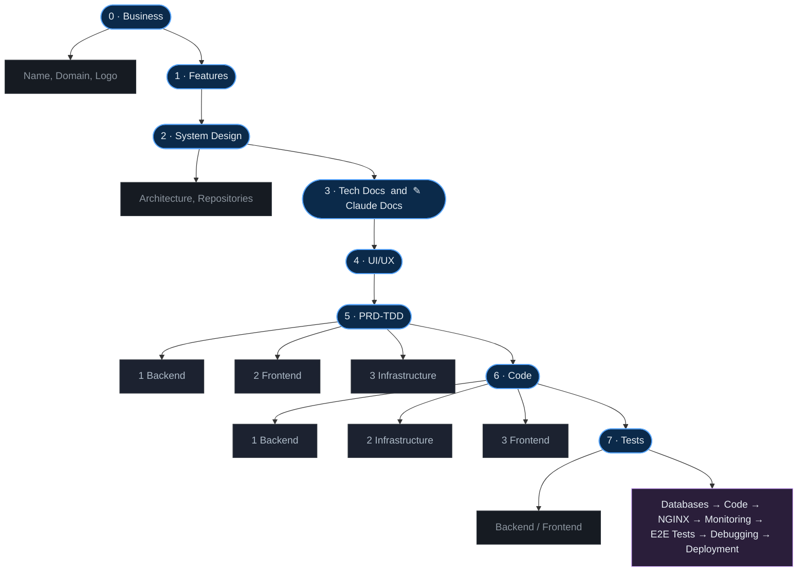
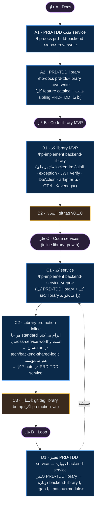

# Soradis Delivery Flow



---

## Fallback (plain text)

```
[0]  Business          →  Name, Domain, Logo
                       ↓
[1]  Features
                       ↓
[2]  System Design     →  Architecture, Repositories
                       ↓
[3]  Tech Docs    and    ✎ Claude Docs
                       ↓
[4]  UI/UX
                       ↓
[5]  PRD-TDD
        ├─ 1 Backend
        ├─ 2 Frontend
        └─ 3 Infrastructure
                       ↓
[6]  Code              →  1 Backend
                          2 Infrastructure
                          3 Frontend
                       ↓
[7]  Tests             →  Backend / Frontend
                       ↓
  Databases  →  Code  →  NGINX  →  Monitoring
             →  E2E Tests  →  Debugging  →  Deployment
```

---

# Backend Library Evolution Flow

روال ساخت + تکامل `backend-shared-logic` و هماهنگی آن با هفت service. جدا از delivery flow بالا — این ریزتر است و روی «بنویس → کد بزن → library inline رشد کن» تمرکز دارد. **PRD-TDD authoritative است — drift/refactor موازی نیاز نیست.**



## Fallback (plain text)

```
[A · Docs]
  A1  PRD-TDD هفت service   →  /hp-docs prd-tdd-backend <repo> ::overwrite   (×7)
  A2  PRD-TDD library        →  /hp-docs prd-tdd-library ::overwrite
                                (کل feature catalog + هفت sibling PRD-TDD کامل)
              ↓
[B · Code library MVP]
  B1  کد library MVP         →  /hp-implement backend-library
                                (ماژول‌های locked-in فقط: Jalali · exception ·
                                 JWT verify · DbAction · MinIO/Kafka/Redis adapter ·
                                 OTel · Kavenegar)
  B2  انسان                  →  git tag v0.1.0 && git push origin v0.1.0
              ↓
[C · Code services (library rises inline)]
  C1  کد service             →  /hp-implement backend-service <repo>   (هر بار)
                                کل PRD-TDD library + کل src/ library را می‌خواند
  C2  Library promotion       (به‌طور خودکار داخل C1)
      inline decision tree (اولین match wins):
        1. Standard مجبور می‌کند library (Jalali · JWT · DbAction · adapter · …)
           → همان run در tech/backend-shared-logic هم می‌نویسد
           → §17 note: promoted → backend-shared-logic:<module>.<symbol>
        2. Cross-service utility + foundational + stable
           → همان کار
        3. Cross-service ولی worthy نیست (domain-carrying · service-specific)
           → local بمان
           → §17 note: considered for library, rejected: <reason>
        4. One-off service-local
           → local
        5. Rare: تنها این service ولی plausible
           → local + §17 note برای future
  C3  انسان                  →  اگر C2 در library نوشت:
                                  git tag v0.1.1 (یا bump مناسب) روی
                                  tech/backend-shared-logic روی main
              ↓
[D · Loop]
  D1  هر تغییر در PRD-TDD    →  دوباره backend-service (برای هر repo تغییری)
                                یا backend-library ::gap (ماژول جدید در PRD-TDD)
                                یا backend-library ::patch=<module> (هر تغییر
                                                                       روی ماژول موجود)
```

## چرا drift/refactor phase جدا نیاز نیست

PRD-TDD کارِ authoritative است. `backend-service` هر بار PRD-TDD service + کل library را fresh می‌خواند. اگر standard الزام کند یا cross-service worthy باشد، همان‌جا در library هم می‌نویسد. Drift زمانی وجود دارد که reality از paper جلو بزند — اگر هر تغییر در paper سپس regenerate از paper، drift نمی‌سازد.

